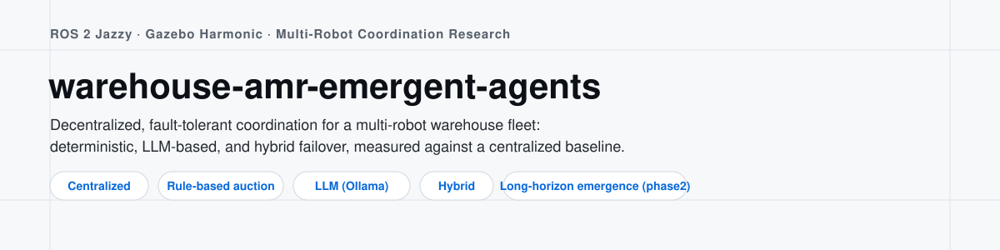
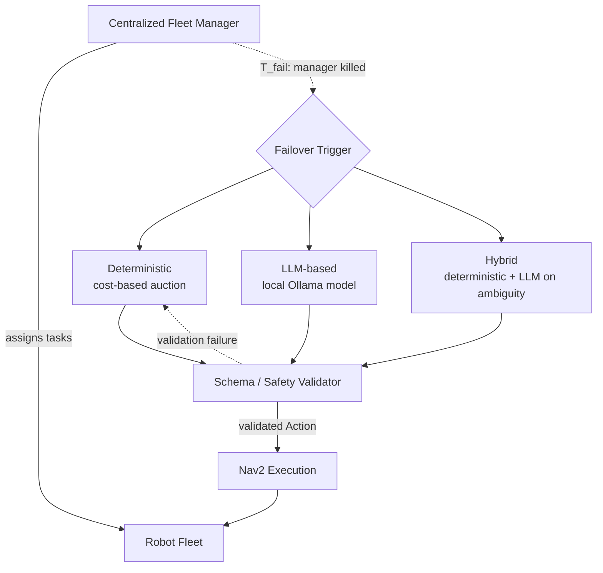
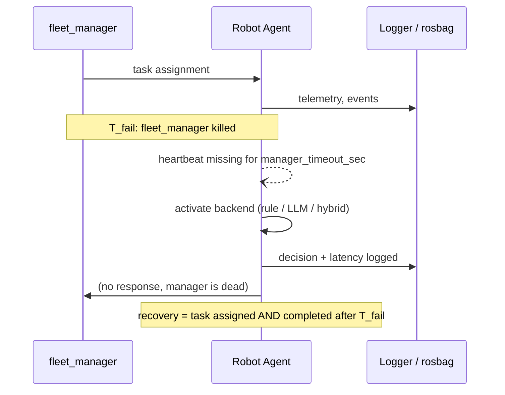
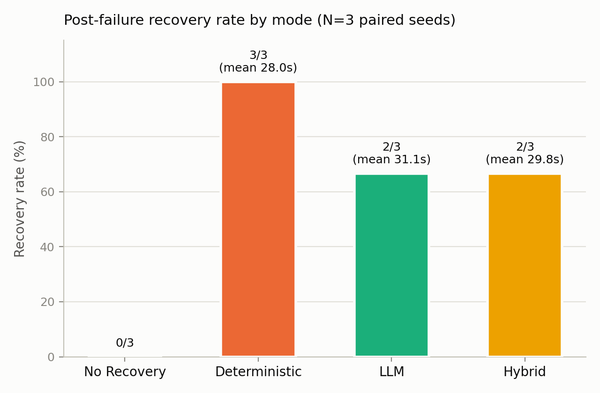
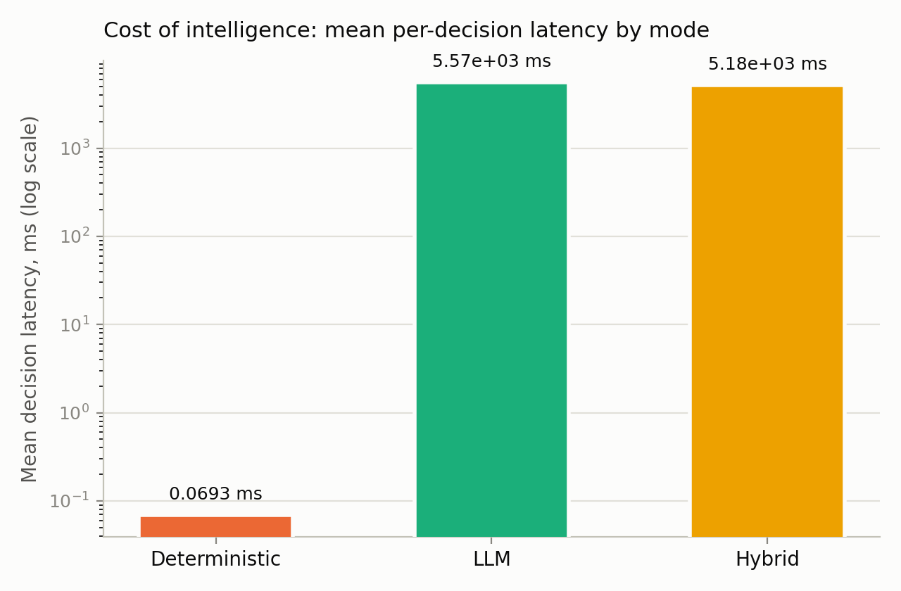
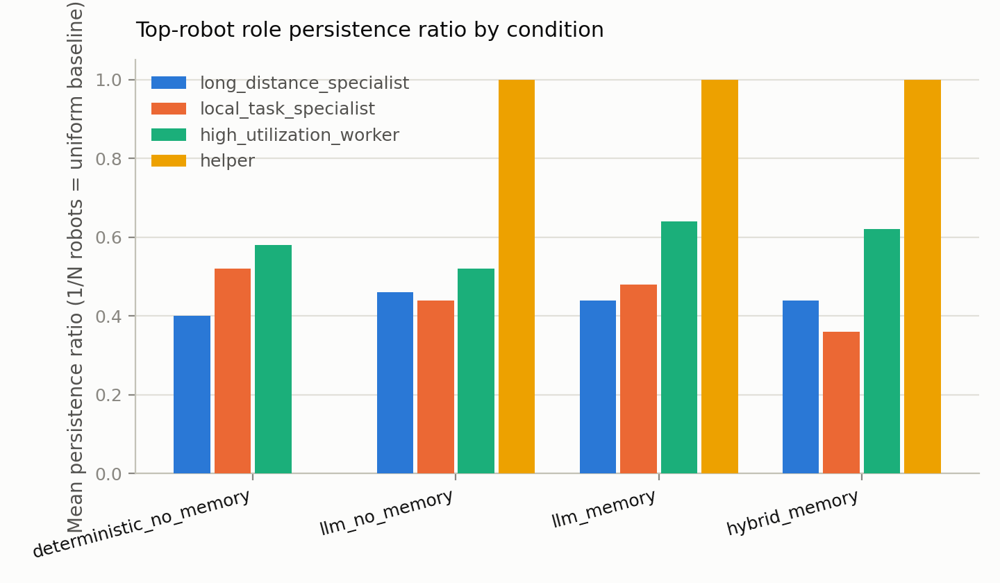

<p align="center">
  
</p>

# warehouse-amr-emergent-agents

[](https://doi.org/10.5281/zenodo.21961193)
[](https://github.com/Pouya-Mansournia/warehouse-amr-emergent-agents-public/actions/workflows/ci.yml)
[](LICENSE)

A research platform for studying decentralized, fault-tolerant, agentic coordination in a multi-robot warehouse fleet, built on ROS 2 Jazzy and Gazebo Harmonic.

When a fleet loses its centralized manager, can the robots recover useful coordination on their own? That's the question I'm testing here. I compare three ways the robots might do it (deterministic peer-to-peer negotiation, LLM-based reasoning, and a hybrid of the two) against the centralized baseline. There's also a second, additive extension that asks a longer-horizon question: does repeated peer-to-peer interaction over many simulated hours produce structure nobody programmed in, like role specialization, peer preference, or resource-sharing conventions?

I built this on top of an earlier project of mine, [warehouse-amr-ros2](https://github.com/Pouya-Mansournia/warehouse-amr-ros2), adding experiment orchestration, robot health and fault modeling, five coordination modes, and a second isolated long-horizon world, all instrumented for reproducible measurement.

## Architecture



The LLM never has a path to motor commands. Every backend, regardless of how it decides, returns the same validated `Action` object consumed by an unchanged Nav2 pipeline (see Safety below).

### Experiment lifecycle



## Coordination modes

| Mode | Description |
| --- | --- |
| Centralized | Single `fleet_manager` node assigns every task. No recovery if it dies. |
| Centralized then decentralized failover | Fleet starts centralized. Robots detect manager heartbeat loss and take over autonomously. |
| Decentralized, rule-based | No central node at any point. Robots bid for stations via a cost-based auction and converge through a shared claim protocol. No coordinator, no LLM. |
| Decentralized, LLM | Each robot's bidding decision is made by a local LLM (Ollama), with strict schema and safety validation plus a deterministic fallback. |
| Hybrid | Deterministic auction handles routine decisions. The LLM is consulted only when the auction is genuinely ambiguous. |

## Repository layout

```
src/
  amr_ros_dg/           Baseline AMR package (imported unmodified from
                         warehouse-amr-ros2): robot description, Gazebo
                         sim, per-robot SLAM + Nav2, fleet_manager, web
                         dashboard. See src/amr_ros_dg/NOTICE.md.
  amr_interfaces/        Shared ROS 2 message definitions (health, faults,
                         claims, negotiation, agent decisions, heartbeat).
  agent_core/             ROS-free, dependency-free agent backends:
                         RuleAgent, LLMAgent, HybridAgent, ReplayAgent,
                         behind a common AgentBackend interface.
  robot_health/           Per-robot health model (battery, mechanical,
                         sensor, navigation, comms, workload) and a
                         declarative fault-injection layer.
  fleet_coordination/     Peer-to-peer decentralized coordination:
                         station-claim protocol, task-transfer
                         negotiation, heartbeat-based failover.
  experiment_manager/     Experiment orchestration: seeding, event
                         logging, rosbag capture, run summaries, plots.
analysis/
  scripts/                Batch experiment runner and statistical
                         report generator (bootstrap CI, paired
                         differences, comparison tables).
  results/                Small, real, derived aggregate results
                         (e.g. resilience_summary.csv).
phase2/                   Isolated, additive long-horizon extension: a
                         lightweight tick-based world (no Gazebo/physics)
                         reusing the same agent backends, for
                         experiments needing many seeds and thousands of
                         simulated seconds per run. See phase2/README.md
                         for its own isolation rules.
docs/                     Short technical notes: architecture, metrics,
                         and known limitations.
```

`experiments/` and `phase2/experiments/` hold raw per-run evidence and are intentionally not tracked in this repository. See Getting Started below for how to regenerate them.

## Requirements

Tested configuration:

| Component | Version |
| --- | --- |
| OS | Ubuntu 24.04 under WSL2 |
| ROS 2 | Jazzy |
| Gazebo | Harmonic |
| Nav2 | bundled with ROS 2 Jazzy |
| Python | 3.12 |
| LLM backend | Local [Ollama](https://ollama.com) server, `llama3.2:1b` |

## Getting started

```bash
colcon build --symlink-install
source install/setup.bash

# Single run, centralized baseline, 2 robots
ros2 run experiment_manager run_experiment \
  --mode centralized_baseline --num-robots 2 --seed 1 --duration 90

# Centralized -> decentralized failover, simulated-time control
ros2 run experiment_manager run_experiment \
  --coordination centralized_then_failover --agent-backend rule \
  --num-robots 2 --seed 1 --time-source simulation \
  --duration 60 --t-fail 15 --manager-timeout-sec 5

# Batch sweep across modes and seeds
python3 analysis/scripts/run_batch.py \
  --modes centralized decentralized --seeds 1:5

# Comparison report from a batch manifest
python3 analysis/scripts/generate_report.py <batch_dir>
```

Every run produces an immutable directory under `experiments/<run_id>/` containing raw event logs, per-robot telemetry CSVs, a rosbag, and a computed `summary.json`, enough to reconstruct exactly what happened without re-running anything. Simulated-time control (`--time-source simulation`) is used throughout so timing-sensitive results don't depend on host wall-clock performance. See [`docs/notes.md`](docs/notes.md) for details.

### The long-horizon extension (`phase2/`)

```bash
python3 phase2/sim/run_experiment.py \
  --condition llm_memory --seed 1 --num-robots 4 --duration-sec 3000 \
  --out-dir phase2/experiments/example_run

python3 phase2/analysis/generate_phase2_report.py phase2/experiments/example_run \
  --out-dir phase2/analysis/results
```

This world is pure Python (no ROS, no Gazebo), so it runs at effectively unlimited speed for the deterministic backend, which makes long-horizon, many-seed experiments practical on ordinary hardware. See [`phase2/README.md`](phase2/README.md) for the isolation rules that keep it from ever touching the main platform's data or code.

## Running the test suite

```bash
source install/setup.bash
python3 -m pytest src analysis -q   # 210 tests, ROS-free logic
python3 -m pytest phase2/test -q    # 39 tests, the phase2/ extension
```

All coordination logic that doesn't require ROS or Gazebo (claim resolution, negotiation, health and fault effects, agent backends, run summarization, statistics) is implemented as plain Python classes specifically so it can be unit-tested without simulation.

## Results

These are pilot-scale results. Check the linked document for exact N, seeds, and confidence intervals before citing any number below.

**Failover comparison** (N=3 paired seeds, 2 robots): deterministic failover recovered in every seed (3/3). LLM-based and hybrid failover recovered in most but not all seeds (2/3 each). The gap is explained by a measured decision-latency cost, not a coordination-logic defect: the deterministic policy decides in about 0.069ms, the LLM in about 5.57s.

<p align="center">
  
  
</p>

See [`analysis/results/resilience_summary.csv`](analysis/results/resilience_summary.csv) for the full numbers.

**Long-horizon pilot** (N=5 paired seeds, 4 robots, `phase2/`): one of five candidate collective-behavior patterns I evaluated meets a pre-registered emergence bar. The rest are either not established or undersampled at this seed count. I'm reporting this as a pilot, not a conclusive emergence claim.

<p align="center">
  
</p>

## Safety

Every LLM-backed decision (the LLM and hybrid modes) passes through the same schema and safety validator before it can become a robot action. A failed validation triggers a deterministic fallback instead of letting an unsafe or malformed action through. The LLM has no path to motor commands, see `src/agent_core/agent_core/` for the validator.

## Limitations

See [`docs/notes.md`](docs/notes.md) for what's implemented, validated, or not yet done. Live validation has used at most 2 robots on the main platform and 4 robots in `phase2/`, the seed counts are pilot-scale (3 and 5 paired seeds respectively), and there's no collision-based safety metric, only Nav2's own `collision_monitor` interventions. I follow one rule throughout this project: never fabricate a result. If something can't be measured yet, it's reported as `not measured`, not filled in with a plausible-looking number.

## Roadmap

- Done: five coordination modes, instrumented and pilot-validated on the main platform
- Done: isolated long-horizon world with role-formation, peer-preference, and resource-convention analysis (`phase2/`, pilot-scale)
- Planned: larger, adequately-seeded campaigns for both families
- Planned: manuscript submission, see Citation below

## Documentation

- [`docs/notes.md`](docs/notes.md): architecture, metric definitions, reproducibility, and known limitations, in one place.
- [`phase2/README.md`](phase2/README.md): the long-horizon extension's own scope and isolation rules.

## Citation

This software is archived on Zenodo: [10.5281/zenodo.21961193](https://doi.org/10.5281/zenodo.21961193). A manuscript describing this platform and its pilot results is in preparation and not yet published. See [`CITATION.cff`](CITATION.cff) for the current citation entry.

## Attribution and license

The `src/amr_ros_dg` package is copied from [warehouse-amr-ros2](https://github.com/Pouya-Mansournia/warehouse-amr-ros2), a project I also wrote. See [`src/amr_ros_dg/NOTICE.md`](src/amr_ros_dg/NOTICE.md) for details.

Licensed under the [BSD 3-Clause License](LICENSE), matching the license declared in each package's `package.xml`.

## Contributing

See [`CONTRIBUTING.md`](CONTRIBUTING.md).

## Security

See [`SECURITY.md`](SECURITY.md).

## Contact

Pouya Mansournia, p.mansournia@gmail.com
